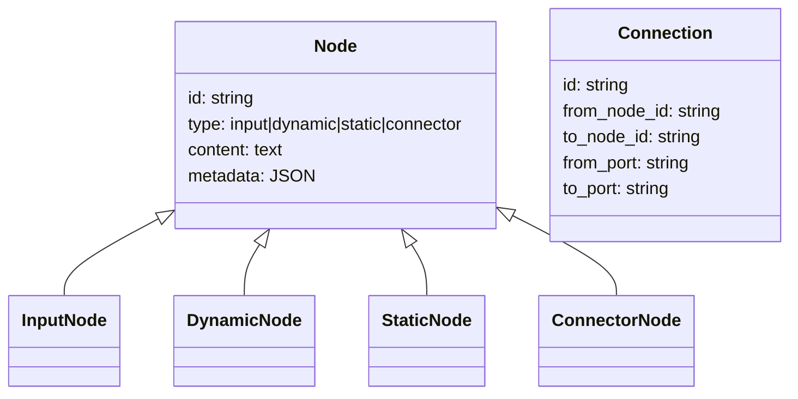
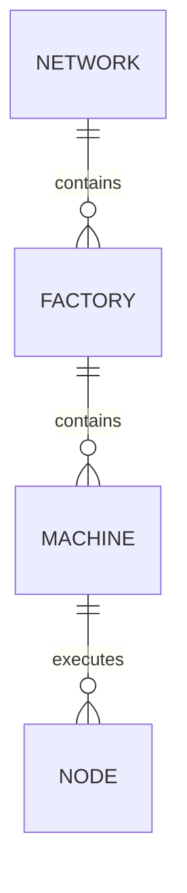
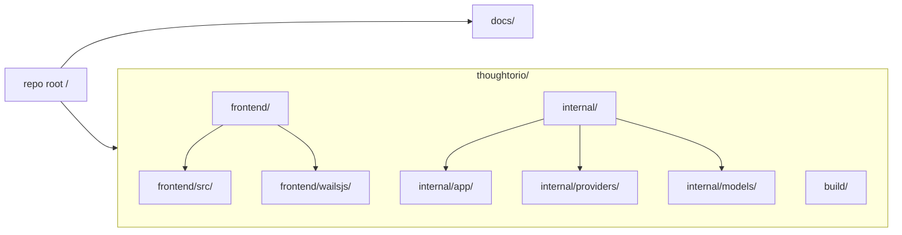
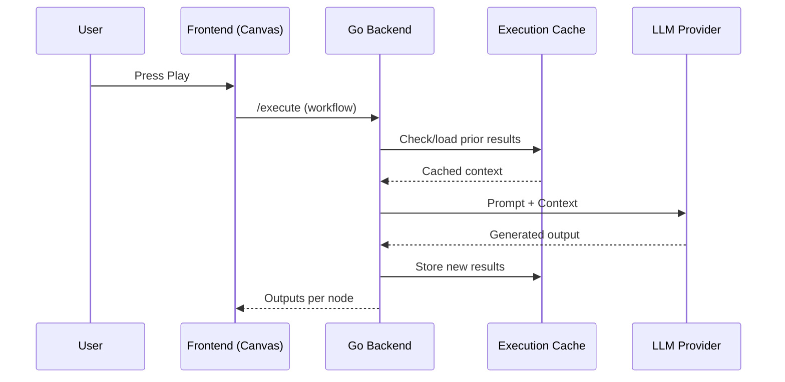

# Thoughtorio: AI-Powered Infinite Canvas Architecture

## Overview

Thoughtorio is an AI-powered infinite canvas tool for building "thought factories" - visual workflows where users can drag and drop nodes to create computational thought processes. The system uses existing Go "legos" (modules) from a story writing tool, repurposed for general knowledge work and ideation.

## Core Concept

Users create visual workflows by:
1. **Dragging nodes** onto an infinite canvas
2. **Connecting nodes** to form logical chains
3. **Pressing play** to execute the workflow and generate AI-powered results

Example workflow: `[Me] → [Work] → [Effort] → [Dynamic Output]`

## Architecture Overview

```
┌─────────────────┐    HTTP API    ┌─────────────────┐
│   Web Frontend  │ ←─────────────→ │   Go Backend    │
│   (Canvas UI)   │                │   (Core Logic)  │
└─────────────────┘                └─────────────────┘
                                          │
                                          ▼
                                  ┌─────────────────┐
                                  │   File Storage  │
                                  │ (.thoughtorio)  │
                                  └─────────────────┘
                                          │
                                          ▼
                                  ┌─────────────────┐
                                  │   CAG System    │
                                  │     (Cache)     │
                                  └─────────────────┘
```

## Component Architecture

### 1. Frontend (Web Canvas)
- **Technology**: HTML5 Canvas or SVG with JavaScript
- **Features**:
  - Infinite scrollable/zoomable canvas
  - Drag & drop node creation and positioning
  - Visual connection drawing between nodes
  - Real-time collaboration support (future)
- **Libraries**: Fabric.js, Konva.js, or custom Canvas API

### 2. Backend (Go HTTP Server)
- **Built on existing legos**:
  - Storage module for file persistence
  - LLM module for AI generation
- **New components**:
  - Canvas manager
  - Node execution engine
  - Workflow orchestrator
- **API Endpoints**:
  - `/canvas/save` - Save canvas to a file
  - `/canvas/load` - Load canvas from a file
  - `/execute` - Workflow execution

### 3. Storage Layer (File-based)
Each canvas is saved as a single `.thoughtorio` file, which is a JSON representation of all nodes, connections, and their properties. This makes canvases portable and easy to share.

### 4. CAG (Cache Augmented Generation) System
- **Purpose**: Provide context-aware AI generation by using previously generated results as context.
- **Implementation**: 
  - During workflow execution, the outputs of completed nodes are cached.
  - This cache is provided to the LLM as context for generating subsequent dynamic node outputs.

## Node Types

### 1. Input Nodes
- **Purpose**: User-editable content that never changes automatically
- **Features**:
  - Rich text editing
  - Markdown support
  - File attachments (future)
- **Persistence**: Content stored in `nodes.content`

### 2. Dynamic Nodes
- **Purpose**: AI-generated outputs that recalculate on workflow execution
- **Features**:
  - Shows loading state during generation
  - Maintains execution history
  - Can be regenerated with different results
- **Generation**: Uses connected inputs + CAG context

### 3. Static Nodes
- **Purpose**: Fixed reference content that doesn't change
- **Use cases**: Constants, templates, reference materials
- **Features**: Read-only display, rich formatting

### 4. Connector Nodes
- **Purpose**: Logic operations and data transformation
- **Types**:
  - **Combine**: Merge multiple inputs
  - **Filter**: Extract specific information
  - **Transform**: Apply functions to inputs
  - **Branch**: Conditional logic

## Workflow Execution Engine

### Execution Flow
1. **Dependency Resolution**: Build execution graph from connections
2. **Topological Sort**: Determine execution order
3. **Context Gathering**: Use CAG to find relevant canvas content
4. **Node Processing**: Execute each node type appropriately
5. **Result Propagation**: Pass outputs to connected nodes

### Execution Rules
- **Input/Static Nodes**: Pass content unchanged
- **Dynamic Nodes**: Generate new content using LLM + context
- **Connector Nodes**: Apply transformation logic
- **Cycles**: Detected and prevented
- **Error Handling**: Graceful degradation with error nodes

## Data Flow

```
User Input → Node Creation → Connection Drawing → Play Button
     ↓
Workflow Analysis → Dependency Graph → CAG Context Gathering
     ↓
LLM Generation → Result Display → Database Persistence
```

## Security & Performance

### Security
- Canvas databases are file-based and isolated
- No direct SQL injection vectors (prepared statements)
- API authentication for multi-user deployments (future)

### Performance
- **Frontend**: Canvas virtualization for large workflows
- **Backend**: Concurrent node execution where possible
- **Database**: Not applicable (file-based storage)
- **CAG**: Caching of intermediate node results

## Extensibility

### Plugin Architecture (Future)
- Custom node types via Go plugins
- JavaScript-based frontend node renderers
- External API integrations

### Export/Import
- Canvas workflows as JSON
- Integration with existing story writing tools
- Version control for workflows

## Development Phases

This architecture supports incremental development:

1. **Phase 1**: Basic canvas with input/dynamic nodes
2. **Phase 2**: CAG integration and context awareness
3. **Phase 3**: Advanced node types and connectors
4. **Phase 4**: Collaboration and sharing features
5. **Phase 5**: Plugin ecosystem and integrations

## Mermaid Diagrams

### Node Architecture



### Workflow / Container Architecture



Clarifications:
- **Machine**: Base execution unit; contains and runs `nodes`. No factories or networks inside.
- **Factory**: Groups `machines`; orchestrates their execution. No standalone nodes directly.
- **Network**: Groups `factories`; orchestrates inter-factory flow. No machines or nodes directly.

### File Architecture



### Context Architecture (CAG)



### Execution Flow

```mermaid
flowchart TD
  A[Build dependency graph] --> B[Topological sort]
  B --> C[Gather CAG context]
  C --> D[Execute node by type]
  D --> E{More nodes?}
  E -- Yes --> D
  E -- No --> F[Persist results + outputs]
  F --> G[Render to canvas]